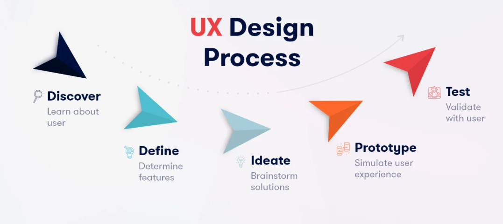

## 2. Méthode de Travail

### 2.1 - Scrum
Nous avons choisi la méthode Scrum pour gérer le projet. Cette approche agile divise le travail en sprints, des périodes courtes où une partie du projet est réalisée. Elle favorise la collaboration, la flexibilité et les améliorations continues en se basant sur des retours fréquents.  

### 2.2 - Méthode 2TUP (Two Track Unified Process)
La méthode 2TUP est utilisée pour structurer le développement. Elle sépare les activités en deux axes : le cycle rapide pour les besoins immédiats (front-end) et le cycle approfondi pour la conception et la réalisation technique (back-end). Cette méthode permet de répondre aux attentes tout en garantissant une base solide.  

### 2.3 - UX Design
L’UX design a été intégré pour créer une interface simple et agréable. Nous avons travaillé sur la compréhension des besoins des utilisateurs (professeurs et responsables), la création de maquettes intuitives, et des tests pour s’assurer que l’outil est facile à utiliser. L’objectif est de garantir une expérience fluide pour tous les utilisateurs.

