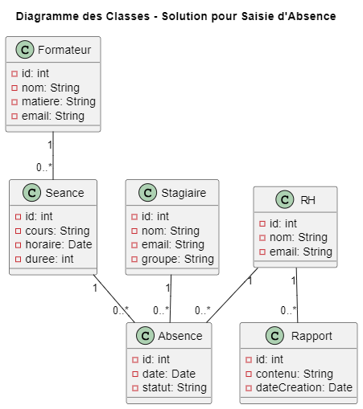
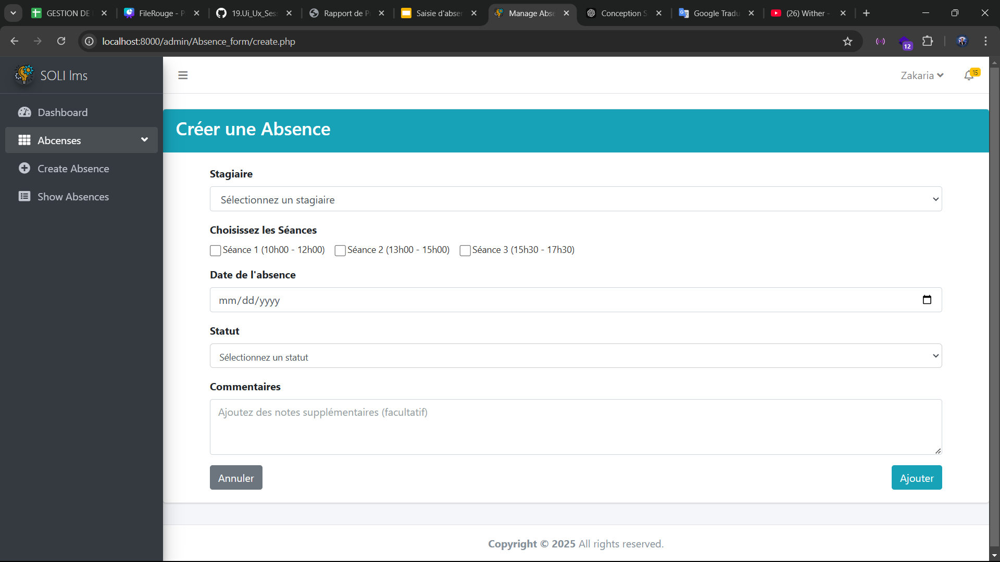
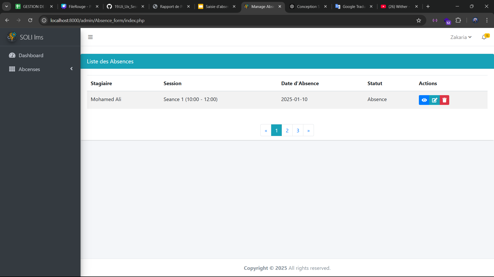
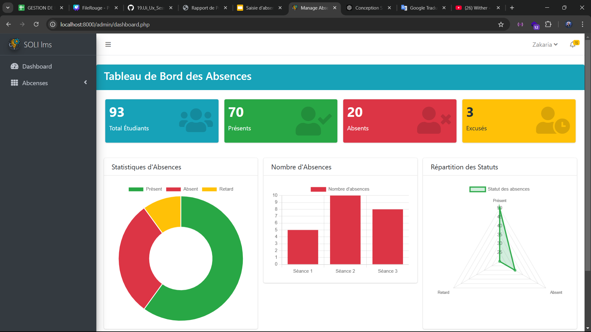

Voici une version en français, simple et claire, pour la section *Step Conception* de ton rapport :

---

## 6. Conception du projet

La section *Conception du projet* décrit l’étape de la transformation des besoins du projet "Saisie d'absence" en une structure claire et organisée. Cette phase comprend la définition de l'architecture du système, la création de diagrammes de classes pour représenter les données et les comportements du système, ainsi que la conception de maquettes pour visualiser l'interface utilisateur (UI). Ces étapes permettent de guider le développement du projet et de s’assurer que tous les composants interagissent de manière efficace pour répondre aux objectifs du projet.

### 6.1 Diagramme des classes

Le diagramme des classes représente les principales entités du système "Saisie d'absence", leurs attributs, méthodes et relations. Il s’agit d’une représentation visuelle de la structure du système et de l’interaction entre les différentes classes. Les classes principales du projet incluent :

### 6.2 Maquette

